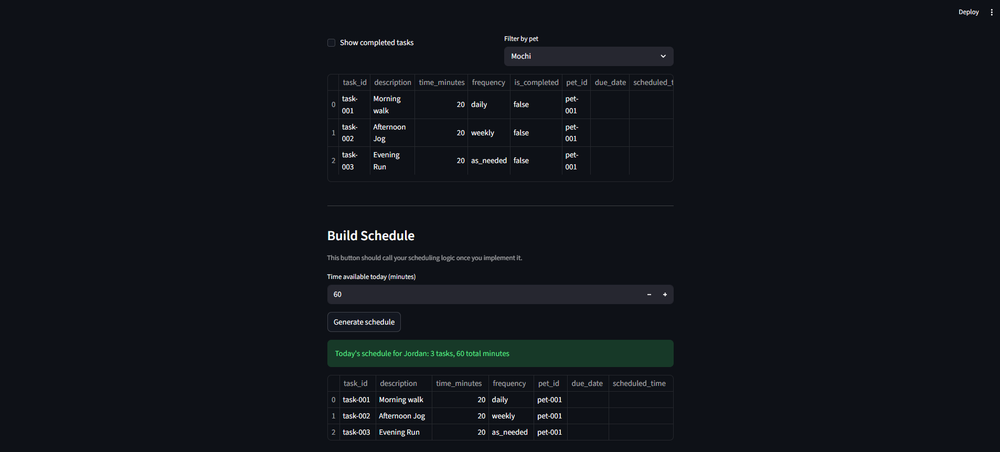

# PawPal+ (Module 2 Project)

You are building **PawPal+**, a Streamlit app that helps a pet owner plan care tasks for their pet.

## Scenario

A busy pet owner needs help staying consistent with pet care. They want an assistant that can:

- Track pet care tasks (walks, feeding, meds, enrichment, grooming, etc.)
- Consider constraints (time available, priority, owner preferences)
- Produce a daily plan and explain why it chose that plan

Your job is to design the system first (UML), then implement the logic in Python, then connect it to the Streamlit UI.

## What you will build

Your final app should:

- Let a user enter basic owner + pet info
- Let a user add/edit tasks (duration + priority at minimum)
- Generate a daily schedule/plan based on constraints and priorities
- Display the plan clearly (and ideally explain the reasoning)
- Include tests for the most important scheduling behaviors

## Smarter Scheduling
To help users plan their tasks better, tasks are sorted by time, frequency, filtered by priority and preferences, and checked for time conflicts to provide the best scheduling to busy pet owners to get their tasks done every time.

## Implemented Features and Algorithms

The current backend in `pawpal_system.py` includes the following implemented logic:

- **Input validation pipeline**: `Task` and `Pet` validate key fields on creation (`__post_init__`) and on setter updates (IDs, durations, frequency values, health status, optional pet links, due dates, and HH:MM scheduled times).
- **Dual storage model for fast operations + display order**: `Owner` and `Pet` maintain both ordered lists and ID maps (`*_ordered` + `*_by_id`) to support efficient lookup/update/delete while preserving display order.
- **Constraint-based schedule building**: `Scheduler.makeSchedule(...)` filters out completed tasks, orders candidates, and greedily selects tasks that fit within `time_available`.
- **Task organization (sorting algorithm)**: `Scheduler.organizeTasks(...)` sorts by frequency rank first (`daily`, `weekly`, `monthly`, `once`, `as_needed`), then by shorter task duration, then by description for stable readable ordering.
- **Preference-aware ranking**: `makeSchedule(...)` tokenizes owner preferences and promotes matching tasks before non-matching tasks.
- **Conflict detection warnings**: `Scheduler.detectTimeConflicts(...)` groups tasks by identical `scheduled_time` and generates warnings when multiple tasks share the same time slot.
- **Recurring task generation (daily/weekly)**: when a task is newly marked complete in `Owner.changeTask(...)`, `_create_next_occurrence_if_needed(...)` creates the next occurrence with an incremented due date and unique recurring ID.
- **Task filtering utilities**: `Owner.filterTasks(...)` supports filtering by completion status and pet name.
- **Cross-entity consistency rules**: adding/removing tasks keeps `Owner` and `Pet` task collections synchronized and enforces valid pet-task relationships by `pet_id`.
- **Scheduling history tracking**: `Scheduler` stores `last_plan`, appends each run to `plan_history`, and exposes `showWarnings()` for UI display.

## Testing PawPal+
Command to Run Tests:
```bash
python -m pytest
```
These tests cover sorting, conflicts, recurrent creation, id collision handling, id generation, input validation around scheduling fields, and some other logic. Overall, they form a comprehensive suite of tests to ensure the app logic flows smoothly. 
Confidence Level: 4 Stars

## Getting started

### Setup

```bash
python -m venv .venv
source .venv/bin/activate  # Windows: .venv\Scripts\activate
pip install -r requirements.txt
```

### Demo
<a href="ai110-week-5-screenshot.png" target="_blank"></a>

### Suggested workflow

1. Read the scenario carefully and identify requirements and edge cases.
2. Draft a UML diagram (classes, attributes, methods, relationships).
3. Convert UML into Python class stubs (no logic yet).
4. Implement scheduling logic in small increments.
5. Add tests to verify key behaviors.
6. Connect your logic to the Streamlit UI in `app.py`.
7. Refine UML so it matches what you actually built.
